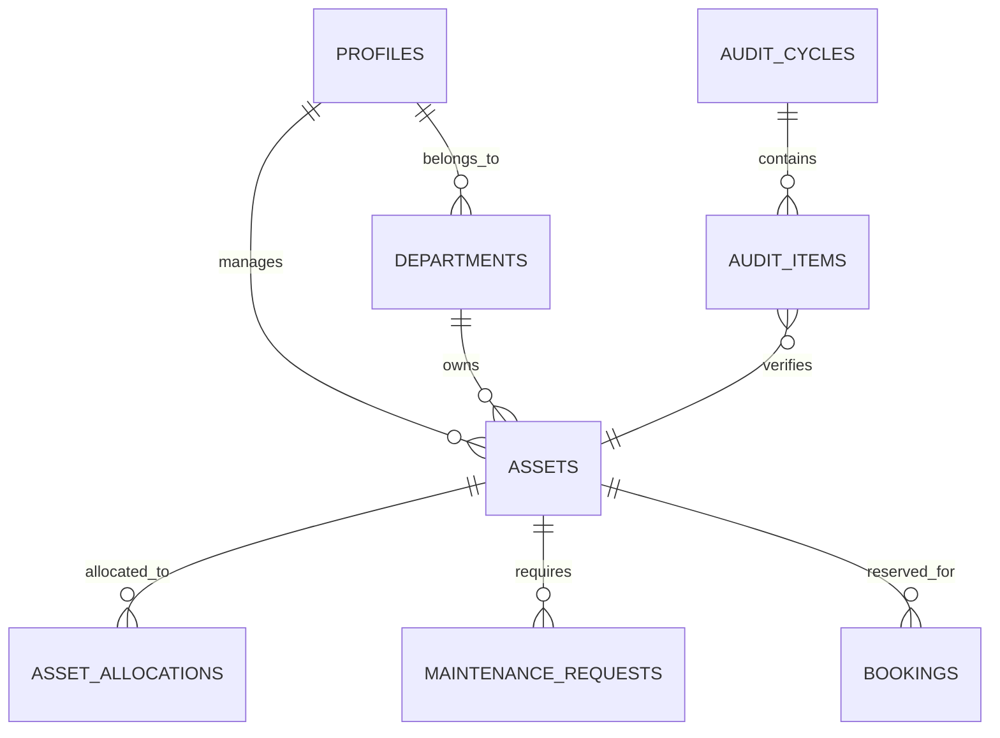

# AssetFlow Enterprise


AssetFlow is a highly polished, enterprise-grade Digital Asset Management & Operations platform designed for the modern organization. Drawing inspiration from top-tier tools like Odoo Enterprise, Linear, and Notion, AssetFlow delivers a premium user experience with robust, real-time backend functionality.

## 🚀 Features

AssetFlow is built around 11 distinct enterprise phases:

1.  **RBAC Security**: Role-based access control (Admin, Manager, Employee) powering dynamic navigation and data access.
2.  **Executive Dashboard**: Real-time KPI cards, animated activity timelines, and actionable AI insights.
3.  **Organization Setup**: Manage departments, locations, and personnel with detailed profile directories.
4.  **Asset Registry**: A comprehensive digital directory of all physical and software assets.
5.  **Lifecycle Workflow**: Track allocations, re-assignments, and returns with enterprise state machines.
6.  **Resource Booking**: A conflict-preventing scheduling engine for shared assets (meeting rooms, vehicles, etc).
7.  **Maintenance Engine**: File, assign, and track maintenance tickets for broken assets.
8.  **Audit & Verification**: Plan and execute operational audits to ensure 100% compliance across departments.
9.  **Executive Analytics**: A stunning `Recharts` powered dashboard visualizing utilization, maintenance costs, and asset health.
10. **Real-time Notifications**: Instant alerts across the organization powered by Supabase Realtime channels.
11. **AssetFlow AI**: A ChatGPT-inspired floating assistant that queries your database via natural language patterns.

## 🛠 Tech Stack

-   **Frontend**: Next.js 16 (App Router), React 19, TailwindCSS v4
-   **UI & Animations**: `shadcn/ui`, Radix Primitives, Framer Motion, Lucide React, `cmdk`
-   **Data Visualization**: Recharts
-   **Backend / Database**: Supabase (PostgreSQL), Supabase Auth, Supabase Realtime

## 🏗 Architecture & ER Diagram

AssetFlow runs on a fully relational PostgreSQL schema deployed to Supabase.
All business logic enforces referential integrity, and Row Level Security (RLS) protects data at the API layer.



## 📦 Installation & Setup

1. **Clone the repository**
   ```bash
   git clone https://github.com/your-org/assetflow.git
   cd assetflow
   ```

2. **Install dependencies**
   ```bash
   npm install
   ```

3. **Configure Environment**
   Create a `.env.local` file in the root directory:
   ```env
   NEXT_PUBLIC_SUPABASE_URL=your_supabase_project_url
   NEXT_PUBLIC_SUPABASE_ANON_KEY=your_supabase_anon_key
   ```

4. **Deploy Database Migrations**
   Execute the migration files located in `supabase/migrations/` sequentially in your Supabase SQL Editor. You can also run the combined `supabase/pending_migrations.sql`.

5. **Run the Development Server**
   ```bash
   npm run dev
   ```

## 🎥 Hackathon Demo Guide

To demonstrate AssetFlow effectively:
1. Log in using an **Admin** account to access all modules.
2. Wait for the **Welcome Tour** to appear on the first load (or clear your localStorage).
3. Navigate to **Assets** and create a new asset. 
4. Allocate that asset to an Employee. Observe the status change instantly across the app.
5. Hit `Cmd+K` to open the Global Search and search for the newly created asset.
6. Open the **AssetFlow AI Assistant** (Sparkles icon, bottom right) and ask "Who owns [Asset Name]?".
7. Check the **Reports** dashboard to see the Asset Utilization pie chart update dynamically.

## 🛡 License
Internal Enterprise Use Only.
